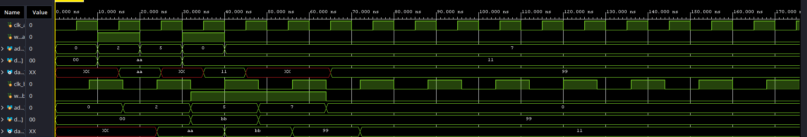
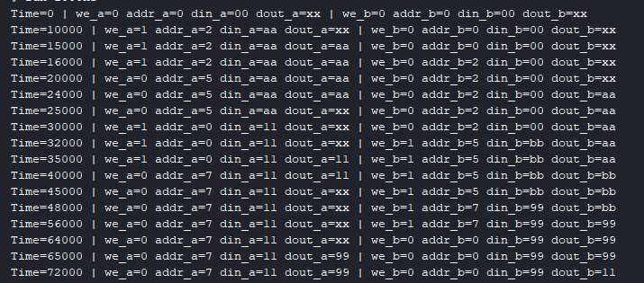

# True Dual-Port BRAM: Architecture and Collision Handling

## Project Overview
This project implements a **True Dual-Port RAM (8x8 bits)** in Verilog, designed as a foundational storage block for a future Asynchronous FIFO system. The primary focus of this design is handling Cross Clock Domains (CDC) and resolving Read-Write memory hazards using a robust "Write-First" (Read-After-Write) strategy. 

## Simple vs. True Dual-Port RAM (Architecture Comparison)
This project is a significant architectural upgrade from the previous `Classic_RAM8_8` design:
* **Port Autonomy:** The previous version was a *Simple Dual-Port RAM*, featuring one dedicated write port and one dedicated read port. This new *True Dual-Port* architecture features two completely independent ports (Port A and Port B). Both ports can read and write to any memory address simultaneously.
* **Clock Domains:** The old design shared a single global clock. This true dual-port implementation supports two independent clocks (`clk_a` and `clk_b`), allowing the memory to bridge two systems running at different frequencies.
* **Initialization (Industry Standard):** The legacy design utilized a global asynchronous reset (`rst`) to clear the memory matrix. To mimic real-world FPGA Block RAM (BRAM) implementations, this project entirely removes the global reset, saving massive routing resources. Uninitialized data is properly handled at the system level.

## Features & Hardware Logic

### Verilog Design
* **Write-First Hazard Resolution:** If a port attempts to read and write to the exact same address in the same clock cycle, the design utilizes bypass logic. The newly written data is forwarded directly to the output register, preventing the reading of stale data.
* **No Global Reset:** Memory initializes with undefined states (`X`), requiring the system to strictly write data before reading it, mirroring physical silicon behavior.

### Testbench Strategy
* **Asynchronous Clocks:** The testbench drives `clk_a` with a 10ns period and `clk_b` with a 16ns period to verify independent operation.
* **Collision Forcing:** Deliberately forces simultaneous read/write operations on the same addresses to validate the bypass logic.
* **Negative Edge Stimuli:** Inputs are safely injected on the falling edge (`negedge clk`) to guarantee strict setup time compliance before the sampling rising edge.

## Waveform Analysis

The waveform simulation effectively demonstrates the correct behavior of the dual-port architecture, specifically highlighting the following hardware realities:

1. **Initial Undefined States (`XX` / Unknowns):** At the beginning of the simulation, the read outputs (`data_out_a` and `data_out_b`) frequently display `XX` (highlighted in red). This happens because we intentionally omitted a global reset signal to optimize routing resources.Therefore, any attempt to read an address *before* explicitly writing data to it will route this "garbage" data to the output. The outputs only resolve to valid hexadecimal values once a Write Enable (`we`) signal explicitly overwrites the `X` states at those specific addresses.
2. **Write-First Bypass (Port B):** When Port B writes `BB` to address 5, `data_out_b` updates to `BB` instantly in the same cycle. This proves the internal bypass logic successfully prevents reading stale data during a read-write collision.
3. **Seamless Cross-Port Communication:** The waveform shows Port B writing the value `99` to address `7`. Shortly after, Port A reads address `7` and successfully outputs `99`. This works seamlessly because both ports, despite having completely independent clocks and control logic, can access the exact same physical storage matrix (`reg [7:0] memory [0:7]`).

## Project Structure

| Folder/File | Description |
| :---------- | :---------- |
| `Design/` | The True Dual-Port design implementation. |
| `Testbench/` | Contains the testbench simulation. |
| `results/` | Contains waveforms and TCL Console images. |
